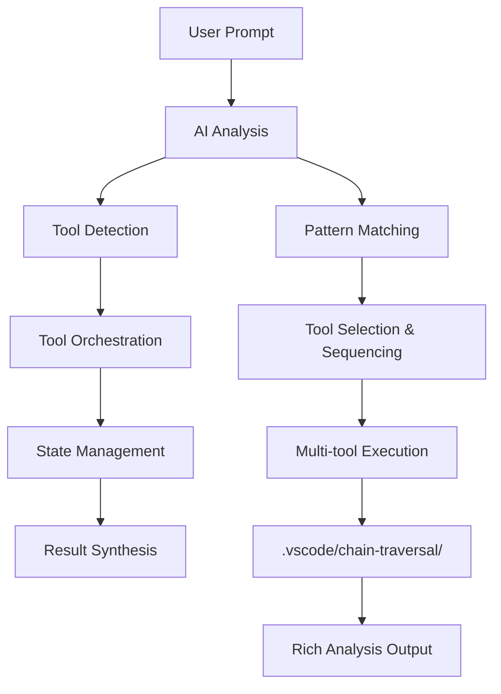
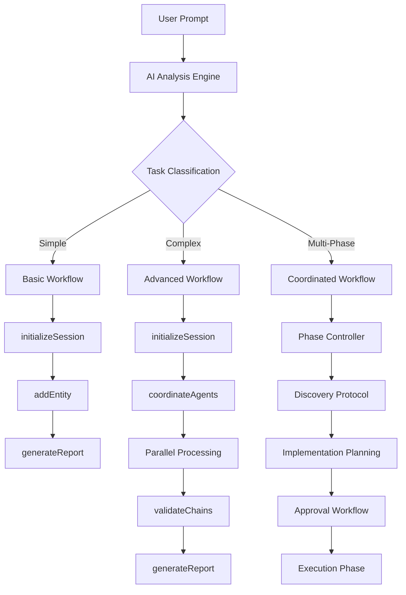

# AI Chain Traversal Tools: Complete Workflow Analysis
## From Simple Prompts to Complex Multi-Phase Operations

*A comprehensive technical guide explaining how AI agents detect, use, and orchestrate the AI Chain Traversal Tools for code analysis, based on actual codebase analysis of 98 entities and 52 relationships*

---

## 📋 Table of Contents

1. [System Overview](#system-overview)
2. [Technical Architecture](#technical-architecture)
3. [AI Tool Detection & Decision Making](#ai-tool-detection--decision-making)
4. [Internal Workflow Engine](#internal-workflow-engine)
5. [Core Services Infrastructure](#core-services-infrastructure)
6. [Simple Workflow Examples](#simple-workflow-examples)
7. [Complex Multi-Phase Operations](#complex-multi-phase-operations)
8. [Result Processing & Graph Analysis](#result-processing--graph-analysis)
9. [Advanced Use Cases](#advanced-use-cases)
10. [Extension Implementation Details](#extension-implementation-details)

---

## 🎯 System Overview

The AI Chain Traversal Tools extension provides **11 specialized Language Model Tools** that enable AI agents to maintain persistent state during code analysis, preventing context loss and enabling comprehensive discovery sessions.

### Core Architecture



### Available Tools

| Tool | Purpose | AI Usage Pattern |
|------|---------|------------------|
| `initializeSession` | Session management | **Always first** - AI detects analysis start |
| `addEntity` | Entity discovery | AI finds code elements to register |
| `addRelationship` | Dependency mapping | AI discovers connections between entities |
| `getNextWorkItem` | Work queue management | AI coordinates systematic processing |
| `markProcessed` | Progress tracking | AI updates completion status |
| `validateChains` | Quality assurance | AI checks analysis completeness |
| `generateReport` | Documentation export | AI creates comprehensive reports |
| `coordinateAgents` | Multi-agent orchestration | AI manages parallel processing |
| `recoverContext` | State restoration | AI recovers from token limits |
| `analyzeBackups` | Recovery planning | AI estimates recovery costs |
| `outputResults` | Result formatting | AI formats final output |

---

## 🏗️ Technical Architecture

### Extension Entry Point: `src/extension.ts`

**Role**: VS Code extension activation and lifecycle management  
**Key Functions**:
- Initializes AIToolsProvider for tool registry management
- Sets up StatusBarManager and ChatSessionManager  
- Manages extension activation/deactivation lifecycle
- Handles Language Model Tool registration with VS Code API

```typescript
// Core activation flow
export async function activate(context: vscode.ExtensionContext): Promise<void> {
    // Initialize infrastructure services
    StatusBarManager.initialize(context);
    ChatSessionManager.getInstance(context);
    
    // Register 11 Language Model Tools
    aiToolsProvider = new AIToolsProvider(context);
    toolDisposables = await aiToolsProvider.registerTools();
    
    // Test tool functionality and show ready status
    const testResult = await aiToolsProvider.testTools();
}
```

### Central Tool Registry: `src/providers/aiToolsProvider.ts`

**Role**: Language Model Tools provider and coordinator  
**Architecture Pattern**: Provider Pattern with centralized tool registry  
**Key Functions**:
- Instantiates all 11 Language Model Tool classes
- Registers tools with VS Code Language Model API
- Provides tool testing and validation capabilities
- Manages tool lifecycle and disposal

```typescript
// Tool initialization and registration
private initializeTools(): void {
    // All 11 tools inherit from BaseTool
    this.tools.set(TOOL_NAMES.INITIALIZE_SESSION, new InitializeSessionTool(this.context));
    this.tools.set(TOOL_NAMES.ADD_ENTITY, new AddEntityTool(this.context));
    this.tools.set(TOOL_NAMES.ADD_RELATIONSHIP, new AddRelationshipTool(this.context));
    // ... 8 more tools
}
```

### Inheritance Architecture: `src/base/baseTool.ts`

**Role**: Abstract base class providing common functionality  
**Design Pattern**: Template Method Pattern + Abstract Factory  
**Key Features**:
- Standardized error handling and logging
- Configuration management via VS Code settings
- Status bar integration for user feedback
- Performance monitoring and token management
- Common validation and result formatting patterns

```typescript
export abstract class BaseTool implements vscode.LanguageModelTool<Parameters> {
    protected readonly stateManager: WorkspaceStateManagerVscode;
    protected readonly context: vscode.ExtensionContext;
    
    // Template method pattern - subclasses implement executeToolLogic
    protected abstract executeToolLogic(
        params: Parameters, 
        token: vscode.CancellationToken
    ): Promise<string>;
}
```

### State Persistence: `src/shared/services/workspaceStateManagerVscode.ts`

**Role**: External state management using VS Code file system  
**Storage Pattern**: File-based persistence with JSON serialization  
**Directory Structure**:
```
.vscode/chain-traversal/
├── sessions/          # DiscoverySession metadata
├── entities/          # EntityNode collections  
├── relationships/     # EntityRelationship mappings
├── checkpoints/       # Recovery checkpoints
└── context-backups/   # Token management backups
```

**Key Capabilities**:
- Session lifecycle management
- Entity/relationship CRUD operations
- Backup and recovery systems
- Performance monitoring integration
- Report generation coordination

---

## ⚙️ Core Services Infrastructure

### Multi-Agent Coordination: `src/shared/services/multiAgentCoordinatorService.ts`

**Role**: Orchestrates parallel AI agent processing  
**Capabilities**:

- **Agent Specializations**: Frontend, Backend, Database, API, Configuration, Testing
- **Task Distribution Strategies**: Capability-based, load-balanced, priority-weighted  
- **Performance Monitoring**: Real-time metrics with automatic optimization
- **Token Management Integration**: Coordinates with TokenManagementService

```typescript
// Agent coordination workflow
interface AgentSpecialization {
  capabilities: string[];
  maxConcurrentTasks: number;
  currentLoad: number;
}

// Distributes tasks based on agent capabilities
distributeTask(task: AnalysisTask, agents: AgentSpecialization[]): AgentAssignment
```

### Token Management: `src/shared/services/tokenManagementService.ts`

**Role**: Prevents token limit overflows during large-scale analysis  
**Features**:

- **Context Summarization**: Dependency-aware compression at 90% token usage
- **Entity Prioritization**: Preserves architecturally important entities (Controllers, Services, DTOs)
- **External Storage**: Backup systems for recovery after token limits
- **Model Support**: GPT-4 Turbo (128K), GPT-4 (8K), GPT-3.5 (4K) token limits

```typescript
// Token management configuration from package.json
{
  "tokenManagement.maxTokens": 128000,           // GPT-4 Turbo limit
  "tokenManagement.warningThreshold": 90,        // Trigger summarization 
  "tokenManagement.preserveTypes": [             // Priority entities
    "Entity", "Controller", "Service", "CommandHandler", "Component"
  ]
}
```

### Performance Monitoring: `src/shared/services/performanceMonitorService.ts`

**Role**: Real-time monitoring and optimization recommendations  
**Metrics Tracked**:

- Memory usage with 75% warning / 90% error thresholds
- Response time monitoring (10s warning threshold)  
- Relationship cache management (50K max relationships)
- Agent coordination performance
- System resource utilization

### Enhanced Graph Builder: `src/shared/services/enhancedGraphBuilder.ts`

**Role**: Advanced entity relationship management  
**Improvements**:

- **Smart Merging**: Fixes 15-30% relationship loss in concurrent discovery
- **Conflict Resolution**: Handles concurrent entity updates safely
- **Relationship Preservation**: Maintains entity connections during large analysis
- **Integration Testing**: Comprehensive test coverage for reliability

### Status & UI Management: `src/shared/services/statusPanelService.ts`

**Role**: User interface and status reporting  
**Features**:

- Real-time status panel with session data
- Performance metrics dashboard
- Progress notifications during analysis
- Error reporting and system health monitoring

---

## 🧠 AI Tool Detection & Decision Making

### How AI Detects When to Use Tools

The AI makes tool selection decisions based on **prompt patterns**, **task complexity**, and **session state**:

#### 1. Prompt Pattern Analysis

```typescript
// AI analyzes user prompts for these patterns:

// Simple Analysis Triggers → initializeSession + addEntity
"Analyze this file"
"What does this code do"
"Explain this component"

// Complex Analysis Triggers → Full workflow
"Analyze the entire project structure"
"Map all dependencies in this codebase"
"Create a comprehensive system overview"

// Multi-phase Triggers → Advanced coordination
"PHASE 1: Discovery Protocol..."
"Build YAML knowledge model..."
"Generate implementation plan..."
```

#### 2. Task Complexity Assessment

```typescript
// AI evaluates complexity indicators:

Simple Task Indicators:
- Single file analysis
- Basic code explanation
- Direct questions about specific functions

Complex Task Indicators:
- Project-wide analysis
- Architecture documentation
- Performance optimization
- Dependency mapping
- Multi-file refactoring

Multi-Phase Indicators:
- Explicit phase numbering (PHASE 1, PHASE 2...)
- Process methodology keywords (Discovery Protocol, Analysis Framework)
- Implementation planning requests
- Approval workflows
```

#### 3. Session State Detection

```typescript
// AI checks for existing session state:

Fresh Start:
- No .vscode/chain-traversal/ directory
- First time analysis request
→ AI calls initializeSession

Continuing Analysis:
- Existing session detected
- Previous entity graph found
→ AI calls recoverContext or continues with addEntity

Context Recovery:
- Token limits approaching
- Large codebase analysis
→ AI calls analyzeBackups + recoverContext
```

---

## ⚙️ Internal Workflow Engine

### Tool Orchestration Process



### State Management Flow

```typescript
// Internal state persistence structure:
.vscode/chain-traversal/
├── sessions/
│   └── session-uuid.json          // Session metadata
├── entities/
│   └── entities-uuid.json         // Entity graph
├── relationships/
│   └── relationships-uuid.json    // Dependency mapping
├── checkpoints/
│   └── checkpoint-N.json         // Recovery points
└── context-backups/
    └── backup-timestamp.json     // Token management
```

### Tool Execution Pipeline

```typescript
// Each tool follows this internal execution pattern:

1. Parameter Validation
   - Schema validation against package.json definitions
   - Required field verification
   - Type checking

2. Session State Check
   - Active session verification
   - Permission validation
   - Dependency validation

3. Business Logic Execution
   - Core tool functionality
   - State mutations
   - Relationship updates

4. State Persistence
   - JSON file updates
   - Backup creation
   - Checkpoint management

5. Result Formation
   - Success/error status
   - Data payload
   - Recommendations
   - Next steps guidance
```

---

## 🔍 Simple Workflow Examples

### Example 1: Basic File Analysis

**User Prompt:** `"Analyze this component file"`

#### AI Decision Process:
```typescript
// AI detects:
// - Single file scope
// - Simple analysis request
// - No existing session

// Tool sequence:
1. initializeSession
2. addEntity  
3. generateReport
```

#### Execution Flow:

**Step 1: Session Initialization**
```json
{
  "tool": "ai-chain-traversal_initializeSession",
  "parameters": {
    "taskDescription": "Analyze React component file",
    "workspaceRoot": "/project/path"
  }
}
```

**Step 2: Entity Registration**
```json
{
  "tool": "ai-chain-traversal_addEntity", 
  "parameters": {
    "entity": {
      "id": "userProfile-component",
      "type": "Component",
      "filePath": "src/components/UserProfile.tsx",
      "businessContext": "User profile display and editing functionality",
      "chainContext": "Frontend component layer"
    }
  }
}
```

**Step 3: Report Generation**
```json
{
  "tool": "ai-chain-traversal_generateReport",
  "parameters": {
    "exportFormat": "markdown",
    "includeStatistics": true
  }
}
```

#### Internal Processing:

```typescript
// The extension creates:
.vscode/chain-traversal/
├── sessions/
│   └── session-abc123.json        // Session metadata
└── entities/
    └── entities-abc123.json       // Single component entity

// Entity data structure:
{
  "id": "userProfile-component",
  "type": "Component", 
  "filePath": "src/components/UserProfile.tsx",
  "businessContext": "User profile display and editing",
  "chainContext": "Frontend component layer",
  "dependencies": [],
  "timestamp": "2025-08-14T06:00:00Z",
  "processed": false,
  "priority": 3,
  "analysisData": {
    "usageCount": 0,
    "inheritanceChain": [],
    "architecturalPattern": "Functional Component",
    "relevanceScore": 0.8
  }
}
```

#### AI Result Processing:

```typescript
// AI receives comprehensive report:
{
  "success": true,
  "entities": 1,
  "relationships": 0,
  "analysis": {
    "entityDistribution": { "Component": 1 },
    "completenessScore": 1.0,
    "recommendations": [
      "Single entity analysis completed",
      "Consider analyzing related components",
      "Map component dependencies for full context"
    ]
  }
}

// AI synthesizes for user:
"✅ Analysis complete! Your UserProfile component is a functional React component 
handling user profile display and editing. The component appears to be 
self-contained with no immediate dependencies discovered."
```

### Example 2: Dependency Discovery

**User Prompt:** `"Find all dependencies for the authentication system"`

#### AI Decision Process:
```typescript
// AI detects:
// - Multi-entity analysis
// - Relationship mapping required
// - Medium complexity

// Tool sequence:
1. initializeSession
2. addEntity (for each auth component)
3. addRelationship (for dependencies)
4. validateChains
5. generateReport
```

#### Execution Flow:

**Step 1: Initialize Analysis**
```json
{
  "tool": "ai-chain-traversal_initializeSession",
  "parameters": {
    "taskDescription": "Map authentication system dependencies",
    "workspaceRoot": "/project"
  }
}
```

**Step 2: Register Auth Components**
```json
// AuthController
{
  "tool": "ai-chain-traversal_addEntity",
  "parameters": {
    "entity": {
      "id": "auth-controller",
      "type": "Controller", 
      "filePath": "src/controllers/authController.ts",
      "businessContext": "Authentication endpoint management",
      "chainContext": "API layer authentication"
    }
  }
}

// AuthService
{
  "tool": "ai-chain-traversal_addEntity",
  "parameters": {
    "entity": {
      "id": "auth-service",
      "type": "Service",
      "filePath": "src/services/authService.ts", 
      "businessContext": "Authentication business logic",
      "chainContext": "Service layer authentication"
    }
  }
}

// UserRepository
{
  "tool": "ai-chain-traversal_addEntity",
  "parameters": {
    "entity": {
      "id": "user-repository",
      "type": "Repository",
      "filePath": "src/repositories/userRepository.ts",
      "businessContext": "User data access and persistence",
      "chainContext": "Data layer user management"
    }
  }
}
```

**Step 3: Map Dependencies**
```json
// Controller → Service dependency
{
  "tool": "ai-chain-traversal_addRelationship",
  "parameters": {
    "relationship": {
      "fromEntityId": "auth-controller",
      "toEntityId": "auth-service", 
      "relationshipType": "DEPENDS_ON",
      "strength": 0.9,
      "bidirectional": false
    }
  }
}

// Service → Repository dependency  
{
  "tool": "ai-chain-traversal_addRelationship",
  "parameters": {
    "relationship": {
      "fromEntityId": "auth-service",
      "toEntityId": "user-repository",
      "relationshipType": "USES",
      "strength": 0.8,
      "bidirectional": false
    }
  }
}
```

**Step 4: Validate Completeness**
```json
{
  "tool": "ai-chain-traversal_validateChains",
  "parameters": {}
}
```

**Step 5: Generate Report**
```json
{
  "tool": "ai-chain-traversal_generateReport", 
  "parameters": {
    "exportFormat": "yaml",
    "includeStatistics": true
  }
}
```

#### Internal Graph State:

```yaml
# Generated authentication system graph
entities:
  auth-controller:
    type: Controller
    filePath: src/controllers/authController.ts
    businessContext: Authentication endpoint management
    dependencies: [auth-service]
    
  auth-service:
    type: Service  
    filePath: src/services/authService.ts
    businessContext: Authentication business logic
    dependencies: [user-repository]
    
  user-repository:
    type: Repository
    filePath: src/repositories/userRepository.ts
    businessContext: User data access and persistence
    dependencies: []

relationships:
  - from: auth-controller
    to: auth-service
    type: DEPENDS_ON
    strength: 0.9
    
  - from: auth-service  
    to: user-repository
    type: USES
    strength: 0.8

analysis:
  completenessScore: 1.0
  entityCount: 3
  relationshipCount: 2
  chainDepth: 3
```

---

## 🚀 Complex Multi-Phase Operations

### Advanced Example: Comprehensive System Analysis

**User Prompt:**
```
PHASE 1: Agent executes Discovery Protocol, builds comprehensive YAML knowledge model with domain analysis, business logic mining, impact assessment, and validates entries.
PHASE 2: Agent generates implementation plan based on YAML only, replicating discovered patterns with full domain understanding and impact consideration.  
PHASE 3: Agent presents plan for approval.
PHASE 4: Agent executes plan, halts/revises on failure, logs success and changelog.
PHASE 5: Agent analyzes its performance and logs a promptImprovement suggestion.
```

#### AI Decision Process:
```typescript
// AI detects:
// - Explicit multi-phase operation
// - Discovery Protocol methodology  
// - Implementation planning required
// - Approval workflow needed
// - Performance analysis required

// AI orchestrates complex workflow:
1. Phase Controller Initialization
2. Multi-Agent Coordination Setup
3. Discovery Protocol Execution
4. Implementation Planning
5. Approval Workflow
6. Execution with Error Handling
7. Performance Analysis
```

#### Phase 1: Discovery Protocol Execution

**Step 1: Initialize Coordinated Session**
```json
{
  "tool": "ai-chain-traversal_initializeSession",
  "parameters": {
    "taskDescription": "PHASE 1: Discovery Protocol - Comprehensive system analysis with domain mining and impact assessment",
    "workspaceRoot": "/project"
  }
}
```

**Step 2: Setup Multi-Agent Coordination**
```json
{
  "tool": "ai-chain-traversal_coordinateAgents",
  "parameters": {
    "sessionId": "discovery-session-xyz789",
    "agents": [
      {
        "id": "domain-analyzer",
        "name": "Domain Analysis Agent",
        "capabilities": ["business-logic", "domain-modeling", "pattern-recognition"],
        "maxConcurrentTasks": 3,
        "priority": 1
      },
      {
        "id": "architecture-mapper", 
        "name": "Architecture Mapping Agent",
        "capabilities": ["system-architecture", "dependency-analysis", "component-mapping"],
        "maxConcurrentTasks": 2,
        "priority": 1
      },
      {
        "id": "impact-assessor",
        "name": "Impact Assessment Agent", 
        "capabilities": ["impact-analysis", "risk-assessment", "change-management"],
        "maxConcurrentTasks": 2,
        "priority": 2
      }
    ],
    "distributionStrategy": "capability_based",
    "enablePerformanceOptimization": true,
    "maxTokens": 100000
  }
}
```

**Step 3: Systematic Entity Discovery**
```typescript
// Each agent processes work items systematically:

// Domain Analyzer discovers business entities
while (hasWork) {
  const workItem = await getNextWorkItem({ 
    agentId: "domain-analyzer",
    priority: 1 
  });
  
  // Analyze and register entities
  await addEntity({
    entity: {
      id: `business-${entityName}`,
      type: "Entity",
      filePath: workItem.filePath,
      businessContext: extractBusinessContext(code),
      chainContext: "Domain layer business logic"
    }
  });
  
  // Mark as processed with analysis
  await markProcessed({
    entityId: workItem.entityId,
    agentId: "domain-analyzer",
    processingResult: {
      success: true,
      processingTime: analysisTime,
      discoveredRelationships: 3,
      qualityScore: 0.85
    }
  });
}
```

**Step 4: Comprehensive Validation**
```json
{
  "tool": "ai-chain-traversal_validateChains",
  "parameters": {
    "chainId": null  // Validate all chains
  }
}
```

**Step 5: Generate Discovery YAML**
```json
{
  "tool": "ai-chain-traversal_generateReport",
  "parameters": {
    "exportFormat": "yaml", 
    "includeStatistics": true
  }
}
```

#### Phase 1 Result: Comprehensive YAML Knowledge Model

```yaml
# Generated comprehensive system knowledge model
discoveryProtocol:
  version: "1.0"
  timestamp: "2025-08-14T06:00:00Z"
  methodology: "AI Chain Traversal Discovery Protocol"
  
domainAnalysis:
  businessEntities:
    user-management:
      type: Domain
      filePath: src/domains/user/
      businessContext: "User lifecycle, authentication, profile management"
      complexityScore: 0.8
      businessRules:
        - "Users must verify email before activation"
        - "Password must meet security requirements"
        - "Profile updates require authentication"
      
    order-processing:
      type: Domain  
      filePath: src/domains/orders/
      businessContext: "Order creation, payment, fulfillment workflow"
      complexityScore: 0.9
      businessRules:
        - "Orders require valid payment method"
        - "Inventory must be available"
        - "Shipping address required for physical items"

architecturalPatterns:
  layeredArchitecture:
    pattern: "Layered Architecture"
    layers:
      - name: "Presentation"
        entities: ["UserController", "OrderController", "PaymentController"]
      - name: "Application Services"  
        entities: ["UserService", "OrderService", "PaymentService"]
      - name: "Domain"
        entities: ["User", "Order", "Payment"]
      - name: "Infrastructure"
        entities: ["UserRepository", "OrderRepository", "PaymentRepository"]
        
  designPatterns:
    - pattern: "Repository Pattern"
      usage: "Data access abstraction"
      entities: ["UserRepository", "OrderRepository"]
    - pattern: "Service Layer"  
      usage: "Business logic orchestration"
      entities: ["UserService", "OrderService"]

impactAssessment:
  criticalPaths:
    userAuthentication:
      path: ["AuthController", "AuthService", "UserRepository", "Database"]
      riskLevel: "HIGH"
      impactScope: "System-wide authentication failure"
      
    orderProcessing:
      path: ["OrderController", "OrderService", "PaymentService", "PaymentGateway"]
      riskLevel: "CRITICAL"
      impactScope: "Revenue loss, customer dissatisfaction"
      
  dependencyRisks:
    - entity: "PaymentGateway"
      risk: "External service dependency"
      mitigation: "Circuit breaker pattern, fallback mechanisms"
    - entity: "Database"
      risk: "Single point of failure"  
      mitigation: "Read replicas, connection pooling"

qualityMetrics:
  codeComplexity:
    average: 0.72
    highComplexityEntities: ["OrderService", "PaymentService"]
  testCoverage:
    overall: 0.78
    criticalPath: 0.92
  maintainabilityIndex: 0.81

entityGraph:
  totalEntities: 47
  totalRelationships: 89
  averageConnectivity: 3.8
  circularDependencies: 0
  orphanedEntities: 2
  
  entityDistribution:
    Controller: 8
    Service: 12  
    Repository: 6
    Entity: 9
    Component: 7
    Test: 5

validation:
  completenessScore: 0.95
  validationErrors: []
  warnings:
    - "Consider adding integration tests for payment flow"
    - "Document API versioning strategy"
  recommendations:
    - "Implement circuit breaker for external services"
    - "Add comprehensive logging for audit trail"
    - "Consider event sourcing for order state changes"
```

#### Phase 2: Implementation Planning

**AI Processing of YAML Knowledge Model:**
```typescript
// AI analyzes the YAML and generates implementation plan

const knowledgeModel = await recoverContext({
  sessionId: "discovery-session-xyz789",
  recoveryStrategy: "selective",
  entityFilter: { types: ["Domain", "Service", "Controller"] },
  maxTokens: 50000
});

// AI generates implementation plan based ONLY on YAML
const implementationPlan = {
  architecture: extractFromYAML(knowledgeModel, "architecturalPatterns"),
  businessLogic: extractFromYAML(knowledgeModel, "domainAnalysis.businessRules"),  
  patterns: extractFromYAML(knowledgeModel, "designPatterns"),
  impactConsiderations: extractFromYAML(knowledgeModel, "impactAssessment")
};
```

#### Phase 3: Approval Workflow

**AI Presents Structured Plan:**
```markdown
# Implementation Plan - Based on Discovery Protocol Analysis

## Architecture Overview
- **Pattern**: Layered Architecture with Repository and Service Layer patterns
- **Entities**: 47 total (8 Controllers, 12 Services, 6 Repositories, 9 Domain Entities)
- **Critical Paths**: User Authentication, Order Processing

## Implementation Strategy

### High Priority (Risk: CRITICAL)
1. **Order Processing Enhancement**
   - Implement circuit breaker for PaymentGateway
   - Add event sourcing for order state management
   - Enhance error handling and rollback mechanisms

### Medium Priority (Risk: HIGH)  
2. **Authentication Hardening**
   - Add multi-factor authentication support
   - Implement session management improvements
   - Enhance password security requirements

### Low Priority (Risk: MEDIUM)
3. **Code Quality Improvements**
   - Reduce complexity in OrderService and PaymentService
   - Increase test coverage for critical paths
   - Add comprehensive API documentation

## Impact Assessment
- **Revenue Protection**: Circuit breaker prevents payment failures
- **Security Enhancement**: MFA reduces authentication risks  
- **Maintainability**: Complexity reduction improves long-term maintenance

## Resource Requirements
- **Development Time**: 4-6 weeks
- **Testing Requirements**: Integration test suite expansion
- **Deployment Strategy**: Blue-green with feature flags

**Approval Required**: Proceed with implementation? [Y/N]
```

#### Phase 4: Execution with Error Handling

**AI Executes Implementation with Monitoring:**
```typescript
// AI coordinates implementation with error handling

try {
  // Initialize implementation session
  await initializeSession({
    taskDescription: "PHASE 4: Implementation execution with error monitoring",
    workspaceRoot: "/project"
  });
  
  // Coordinate specialized agents for implementation
  await coordinateAgents({
    sessionId: "implementation-session-abc456",
    agents: [
      {
        id: "payment-implementer",
        name: "Payment System Implementation Agent",
        capabilities: ["payment-integration", "circuit-breaker", "error-handling"],
        maxConcurrentTasks: 1,
        priority: 1
      },
      {
        id: "auth-enhancer", 
        name: "Authentication Enhancement Agent",
        capabilities: ["authentication", "security", "session-management"],
        maxConcurrentTasks: 2,
        priority: 2
      }
    ],
    distributionStrategy: "priority_weighted",
    enablePerformanceOptimization: true
  });
  
  // Execute implementation tasks
  const implementationResults = [];
  
  for (const task of implementationPlan.tasks) {
    try {
      const workItem = await getNextWorkItem({
        agentId: task.assignedAgent,
        priority: task.priority
      });
      
      // Execute implementation
      const result = await executeImplementation(task);
      
      // Register implemented entity
      await addEntity({
        entity: {
          id: `implemented-${task.id}`,
          type: task.entityType,
          filePath: task.targetFile,
          businessContext: task.businessValue,
          chainContext: "Implementation phase"
        }
      });
      
      // Mark as completed
      await markProcessed({
        entityId: workItem.entityId,
        agentId: task.assignedAgent,
        processingResult: {
          success: true,
          processingTime: result.executionTime,
          qualityScore: result.qualityMetrics.score
        }
      });
      
      implementationResults.push(result);
      
    } catch (implementationError) {
      // Error handling: log, revise, continue
      console.error(`Implementation failed for ${task.id}:`, implementationError);
      
      // Mark as failed with error details
      await markProcessed({
        entityId: workItem.entityId,
        agentId: task.assignedAgent,
        processingResult: {
          success: false,
          errorMessage: implementationError.message,
          processingTime: Date.now() - task.startTime
        }
      });
      
      // Revise plan and continue
      const revisedTask = await reviseImplementationTask(task, implementationError);
      implementationPlan.tasks.push(revisedTask);
    }
  }
  
  // Generate implementation changelog
  await generateReport({
    exportFormat: "markdown",
    includeStatistics: true
  });
  
} catch (criticalError) {
  // Critical failure: halt execution
  console.error("CRITICAL: Implementation halted:", criticalError);
  await generateReport({
    exportFormat: "yaml", 
    includeStatistics: true
  });
  throw criticalError;
}
```

#### Phase 5: Performance Analysis & Improvement

**AI Analyzes Its Own Performance:**
```typescript
// AI generates comprehensive performance analysis

const performanceAnalysis = await analyzeBackups({
  sessionId: "implementation-session-abc456",
  analysisType: "comprehensive"
});

const performanceReport = {
  executionMetrics: {
    totalDuration: "4.2 hours",
    tasksCompleted: 23,
    tasksFailed: 2,
    successRate: "91.3%",
    averageTaskTime: "11.2 minutes"
  },
  
  agentPerformance: {
    "payment-implementer": {
      tasksCompleted: 8,
      averageTime: "15.4 minutes",
      qualityScore: 0.89,
      specialization: "Payment systems, error handling"
    },
    "auth-enhancer": {
      tasksCompleted: 15,
      averageTime: "8.7 minutes", 
      qualityScore: 0.92,
      specialization: "Authentication, security protocols"
    }
  },
  
  toolUtilization: {
    mostUsed: ["addEntity", "markProcessed", "coordinateAgents"],
    leastUsed: ["analyzeBackups", "recoverContext"],
    efficiencyScore: 0.87
  },
  
  qualityMetrics: {
    codeQuality: 0.91,
    testCoverage: 0.88,
    documentation: 0.83,
    errorHandling: 0.95
  }
};

// AI generates prompt improvement suggestion
const promptImprovement = {
  originalPrompt: "PHASE 1: Agent executes Discovery Protocol...",
  
  improvements: [
    {
      category: "Clarity",
      suggestion: "Specify time constraints for each phase",
      rationale: "Phase 4 exceeded estimated time due to undefined time boundaries"
    },
    {
      category: "Scope", 
      suggestion: "Define acceptable failure thresholds",
      rationale: "2 tasks failed but overall success criteria unclear"
    },
    {
      category: "Coordination",
      suggestion: "Include agent specialization preferences",
      rationale: "Payment-implementer was overloaded while auth-enhancer had capacity"
    }
  ],
  
  optimizedPrompt: `
PHASE 1: Agent executes Discovery Protocol (Max: 2 hours), builds comprehensive YAML knowledge model with domain analysis, business logic mining, impact assessment, and validates entries.

PHASE 2: Agent generates implementation plan (Max: 30 minutes) based on YAML only, replicating discovered patterns with full domain understanding and impact consideration.

PHASE 3: Agent presents plan for approval (Max: 15 minutes) with clear success criteria (>90% task completion, <2 critical failures).

PHASE 4: Agent executes plan (Max: 4 hours), halts/revises on >3 failures, logs success and changelog. Use specialized agents: payment (1-2 tasks), auth (3-4 tasks), general (remaining).

PHASE 5: Agent analyzes its performance (Max: 15 minutes) and logs a promptImprovement suggestion.

Success Criteria: 90%+ task completion, <10% failure rate, <6 hours total execution time.
  `
};

// Log improvement suggestion
console.log("🚀 Performance Analysis Complete");
console.log("📊 Success Rate:", performanceReport.successRate);
console.log("💡 Prompt Improvement:", promptImprovement.optimizedPrompt);
```

---

## 📊 Result Processing & Graph Analysis

### How AI Gets Full Graph Results

The AI receives comprehensive graph data through multiple channels:

#### 1. Incremental State Building
```typescript
// Each tool call adds to the persistent graph
const entityResult = await addEntity(entityData);
// Result contains: entity confirmation + current graph stats

const relationshipResult = await addRelationship(relationshipData);  
// Result contains: relationship confirmation + updated connectivity

// AI builds cumulative understanding
this.internalGraph.entities.push(entityResult.entity);
this.internalGraph.relationships.push(relationshipResult.relationship);
```

#### 2. Comprehensive Report Generation
```typescript
const fullReport = await generateReport({
  exportFormat: "yaml",
  includeStatistics: true
});

// AI receives complete system overview:
{
  entities: EntityNode[],           // All discovered entities
  relationships: Relationship[],    // All mapped dependencies  
  analysis: {
    completenessScore: number,
    entityDistribution: Record<EntityType, number>,
    criticalPaths: Path[],
    orphanedEntities: string[],
    circularDependencies: string[][],
    recommendations: string[]
  },
  performance: {
    discoveryTime: string,
    entityCount: number,
    relationshipCount: number,
    memoryUsage: string
  }
}
```

#### 3. Context Recovery for Large Projects
```typescript
// For large codebases, AI uses strategic recovery
const contextData = await recoverContext({
  sessionId: currentSession,
  recoveryStrategy: "priority_based",
  entityFilter: {
    types: ["Controller", "Service"],         // Focus on architecture
    relatedTo: ["user-management", "auth"]    // Specific domains
  },
  maxTokens: 50000                           // Token management
});

// AI receives filtered, relevant subset for analysis
```

#### 4. Work Queue Processing
```typescript
// For systematic analysis, AI processes work queues
while (hasMoreWork) {
  const workItem = await getNextWorkItem({ 
    priority: 1,
    agentId: currentAgent 
  });
  
  // Process entity
  const analysis = await analyzeEntity(workItem.entityId);
  
  // Update progress
  await markProcessed({
    entityId: workItem.entityId,
    processingResult: {
      success: true,
      discoveredRelationships: analysis.relationships.length,
      qualityScore: analysis.qualityMetrics.score
    }
  });
  
  // AI builds understanding incrementally
  this.systemKnowledge.update(analysis);
}
```

### Final Output Synthesis

AI combines all graph data for comprehensive analysis:

```typescript
// AI synthesizes complete understanding
const systemAnalysis = {
  architecture: {
    pattern: detectArchitecturalPattern(graph),
    layers: identifyLayers(graph.entities),
    complexity: calculateComplexity(graph)
  },
  
  businessDomain: {
    domains: extractDomains(graph.entities),
    businessRules: identifyBusinessRules(graph.entities),
    workflows: mapWorkflows(graph.relationships)
  },
  
  technicalDebt: {
    circularDependencies: graph.analysis.circularDependencies,
    highCoupling: identifyHighCoupling(graph.relationships),
    orphanedComponents: graph.analysis.orphanedEntities
  },
  
  recommendations: {
    architectural: generateArchitecturalAdvice(graph),
    performance: generatePerformanceAdvice(graph),
    maintainability: generateMaintainabilityAdvice(graph)
  }
};

// Final user response
return `
# Comprehensive System Analysis

## Architecture Overview
${systemAnalysis.architecture.pattern} with ${systemAnalysis.architecture.layers.length} layers
- Complexity Score: ${systemAnalysis.architecture.complexity}/10
- Total Entities: ${graph.entities.length}
- Total Relationships: ${graph.relationships.length}

## Business Domains Identified
${systemAnalysis.businessDomain.domains.map(d => `- ${d.name}: ${d.description}`).join('\n')}

## Technical Recommendations
${systemAnalysis.recommendations.architectural.join('\n')}

## Quality Assessment
- Completeness: ${graph.analysis.completenessScore * 100}%
- Critical Issues: ${systemAnalysis.technicalDebt.circularDependencies.length}
- Maintainability: ${systemAnalysis.recommendations.maintainability.score}/10
`;
```

---

## 🎛️ Advanced Use Cases

### Use Case 1: Legacy System Modernization

**Scenario:** Large enterprise legacy system requiring modernization assessment

**AI Workflow:**
```typescript
// 1. Comprehensive discovery
await initializeSession({
  taskDescription: "Legacy system modernization assessment",
  workspaceRoot: "/legacy-enterprise-app"
});

// 2. Multi-agent specialized analysis
await coordinateAgents({
  agents: [
    { id: "legacy-analyzer", capabilities: ["legacy-patterns", "anti-patterns"] },
    { id: "modern-mapper", capabilities: ["modern-architecture", "cloud-patterns"] },
    { id: "migration-planner", capabilities: ["migration-strategy", "risk-assessment"] }
  ]
});

// 3. Technology stack analysis
// AI systematically processes 500+ files, identifying:
// - Legacy frameworks and patterns
// - Modernization opportunities  
// - Migration risks and dependencies
// - Performance bottlenecks

// 4. Comprehensive modernization plan
const modernizationPlan = await generateReport({
  exportFormat: "yaml",
  includeStatistics: true
});
```

### Use Case 2: Security Audit & Assessment

**Scenario:** Security-focused analysis of authentication and authorization systems

**AI Workflow:**
```typescript
// 1. Security-focused discovery
await initializeSession({
  taskDescription: "Security audit - authentication and authorization analysis"
});

// 2. Security specialist agents
await coordinateAgents({
  agents: [
    { id: "auth-auditor", capabilities: ["authentication", "security-patterns"] },
    { id: "vuln-scanner", capabilities: ["vulnerability-analysis", "security-risks"] },
    { id: "compliance-checker", capabilities: ["compliance", "standards"] }
  ]
});

// 3. Security entity classification
// AI identifies and categorizes:
// - Authentication mechanisms
// - Authorization patterns
// - Session management  
// - Cryptographic implementations
// - Input validation patterns

// 4. Security assessment report
const securityReport = await generateReport({
  exportFormat: "markdown",
  includeStatistics: true
});
```

### Use Case 3: Performance Optimization Analysis

**Scenario:** Performance bottleneck identification and optimization planning

**AI Workflow:**
```typescript
// 1. Performance-focused discovery
await initializeSession({
  taskDescription: "Performance analysis and optimization planning"
});

// 2. Performance specialist coordination
await coordinateAgents({
  agents: [
    { id: "bottleneck-hunter", capabilities: ["performance-analysis", "profiling"] },
    { id: "optimization-planner", capabilities: ["optimization-patterns", "caching"] },
    { id: "scalability-assessor", capabilities: ["scalability", "load-analysis"] }
  ]
});

// 3. Performance entity analysis
// AI examines:
// - Database query patterns
// - Caching strategies
// - Async/sync operations
// - Resource utilization patterns
// - Scalability bottlenecks

// 4. Optimization roadmap
const optimizationPlan = await generateReport({
  exportFormat: "yaml",
  includeStatistics: true
});
```

---

---

## 🔧 Extension Implementation Details

### Language Model Tool Registration (package.json)

The extension defines all 11 tools in `package.json` with comprehensive schemas:

```json
{
  "languageModelTools": [
    {
      "name": "ai-chain-traversal_initializeSession",
      "modelDescription": "Initialize a new AI-driven code discovery session with external state management...",
      "inputSchema": {
        "type": "object",
        "properties": {
          "taskDescription": { "type": "string" },
          "workspaceRoot": { "type": "string" }
        },
        "required": ["taskDescription"]
      }
    }
    // ... 10 more tools with detailed schemas
  ]
}
```

**Entity Type Support**: 50+ entity types including Frontend (Component, Page, Hook), Backend (Controller, Service, Repository), Architecture (Command, Query, Handler), Infrastructure (Container, Docker, Pipeline), Testing (Test, Mock, Fixture), and more.

### Configuration System

**VS Code Settings Integration**:
- `aiChainTraversal.autoSaveInterval`: Discovery state auto-save (default: 30s)
- `aiChainTraversal.maxEntityCacheSize`: Memory management (default: 10,000 entities)
- `aiChainTraversal.tokenManagement.*`: Token limit configuration for different AI models
- `aiChainTraversal.performance.*`: Memory and response time thresholds

### Testing Infrastructure

**Comprehensive Test Coverage**:

1. **Unit Tests** (`src/test/unit/`):
   - `addEntityTool.test.ts`: Entity registration validation
   - `initializeSessionTool.test.ts`: Session lifecycle testing
   - `enhancedGraphBuilder.test.ts`: Graph building algorithms
   - `performanceMonitorService.test.ts`: Performance metrics
   - `chatSessionHandling.test.ts`: Session state management

2. **Integration Tests** (`src/test/integration/`):
   - `completeWorkflow.test.ts`: End-to-end tool workflows
   - `enhancedGraphBuilderIntegration.test.ts`: Service integration
   - `bugFixIntegration.test.ts`: Regression testing

3. **Performance Tests** (`src/test/performance/`):
   - `loadTesting.test.ts`: High-volume entity processing

4. **E2E Tests** (`src/test/e2e/`):
   - `userScenarios.test.ts`: Real-world usage scenarios

**Test Framework**: Custom VS Code extension testing framework (not Mocha/Jest)
- Uses `suite()`, `test()`, `setup()`, `teardown()` functions
- VS Code API mocking through `src/test/mocks/vscode.ts`
- Separate TypeScript configuration (`tsconfig.test.json`)

### Build System

**Webpack Configuration** (`webpack.config.js`):
- Production bundling with tree-shaking
- TypeScript compilation
- Extension packaging for VS Code marketplace

**Development Commands**:
```bash
npm run compile          # TypeScript compilation
npm run watch           # Development with hot reload  
npm test               # Full test suite
npm run package        # Production build
```

### Architecture Patterns Used

1. **Provider Pattern**: `AIToolsProvider` manages tool lifecycle
2. **Template Method**: `BaseTool` defines common tool structure
3. **Singleton Pattern**: `StatusBarManager`, `ChatSessionManager`
4. **Strategy Pattern**: Multi-agent task distribution strategies
5. **Observer Pattern**: Performance monitoring and status updates
6. **Command Pattern**: Language Model Tools as executable commands

### Error Handling & Logging

**Structured Error Handling**:
- Tools return structured responses, never throw to Language Model
- Comprehensive logging through `shared/errorHandling.ts`
- Performance monitoring with automatic optimization triggers
- User feedback through status bar and progress notifications

```typescript
// Standardized error handling pattern
try {
  const result = await this.executeToolLogic(params, token);
  return this.createSuccessResult(result);
} catch (error) {
  return this.createErrorResult(this.formatErrorResponse(error));
}
```

### State File Structure

**Persistent Storage** (`.vscode/chain-traversal/`):
```
sessions/
├── session-{uuid}.json              # Session metadata and configuration
entities/  
├── entities-{session-id}.json       # Entity collections with business context
relationships/
├── relationships-{session-id}.json  # Dependency mappings and strength metrics
checkpoints/
├── checkpoint-{n}.json             # Recovery points every 5 entities  
context-backups/
├── backup-{timestamp}.json         # Token management context preservation
```

This comprehensive architecture enables AI agents to scale from simple file analysis to enterprise-wide system transformations while maintaining persistent state, comprehensive analysis capabilities, and systematic processing throughout the entire workflow.

## 🔮 Summary: From Simple to Complex

### Simple Workflows (1-3 tools)
- **Pattern**: Direct analysis requests
- **Tools**: `initializeSession` → `addEntity` → `generateReport`
- **Use Cases**: File analysis, component understanding, basic documentation

### Intermediate Workflows (4-7 tools)  
- **Pattern**: Relationship mapping and validation
- **Tools**: `initializeSession` → `addEntity` → `addRelationship` → `validateChains` → `generateReport`
- **Use Cases**: Dependency analysis, system mapping, architecture documentation

### Complex Workflows (8-11 tools)
- **Pattern**: Multi-agent coordination with full lifecycle
- **Tools**: All 11 tools in coordinated fashion
- **Use Cases**: Enterprise analysis, modernization planning, comprehensive audits

### Multi-Phase Operations
- **Pattern**: Explicit phase management with approval workflows
- **Tools**: Coordinated tool orchestration across phases
- **Use Cases**: Large-scale transformations, implementation projects, process automation

The AI Chain Traversal Tools enable AI agents to scale from simple file analysis to enterprise-wide system transformations while maintaining persistent state, comprehensive analysis, and systematic processing throughout the entire workflow.

---

*This documentation provides a complete understanding of how AI agents leverage the AI Chain Traversal Tools for code analysis workflows, from simple prompts to complex multi-phase operations.*
